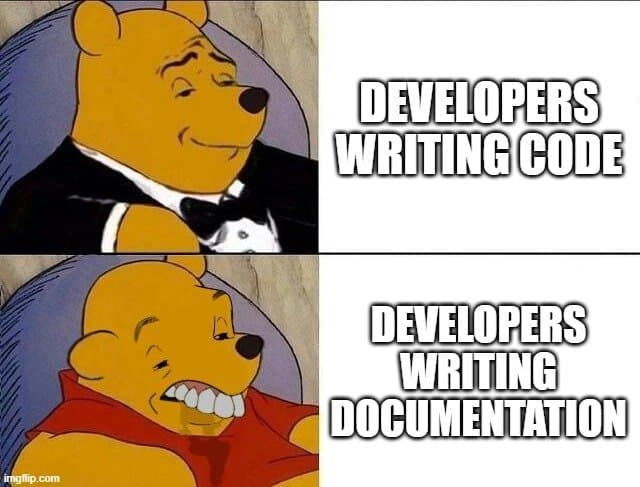
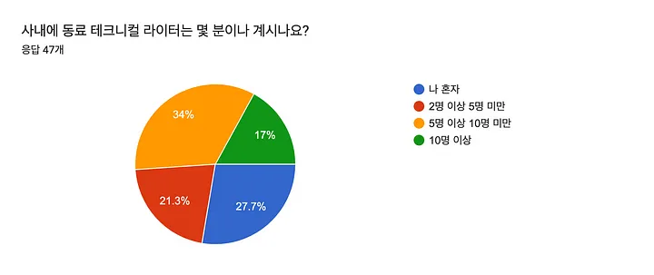
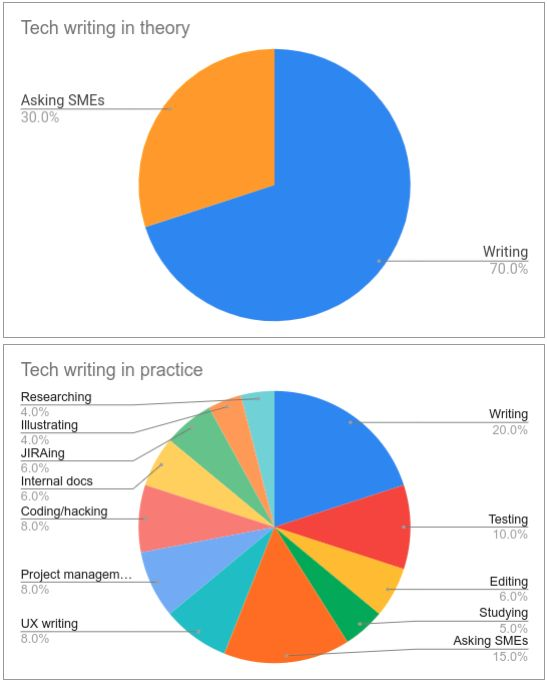

여러분은 혹시 기술문서 작성을 중심으로 작업하는 테크니컬 라이터에 대해 아시나요?
아마 모르는 분들도 꽤 있을 것으로 생각합니다.
실제로 필자도 이 직업을 알았던 시기는 반년도 채 안 되었거든요.

밈으로도 있듯이, 문서화를 좋아하는 개발자는 많이 있진 않습니다.

그런데 문서화를 전문으로 하는 사람들이 있다는 거 아시나요? 바로 **테크니컬 라이터**입니다.

## 테크니컬 라이터는 정확히 뭘 하는 사람일까?

**간단히 말하면**:
기술적인 내용을 이해하기 쉽게 글로 쓰는 전문가

**구체적으로는**:

- API 명세서, 개발 가이드 작성
- 개발자용 공식 문서 제작
- 사용자 매뉴얼, 설치 가이드 작성

많은 it 기업에서 인원은 적지만, 테크니컬 라이터를 고용하여 하나의 팀으로 운영하기도 합니다.
아래의 사진을 참고하여 보면
표본 약 50개의 국내 회사에서 거의 절반은 5명 미만인 팀으로 운영한다고 하죠.
그리고 10명 이상 근무하는 회사도 17%밖에 되지 않죠.

사진 출처: https://youtu.be/eYGTcISTjXk?si=nyfav2ou0O1j-W7N&t=167

### 실제로는 글쓰기만 하지 않는다

그렇다면 테크니컬 라이터 분들은 정말 글쓰기 작업만 할까요?
실제로는 글쓰기 작업이 의외로 적은 비중을 차지한다고 합니다.

아래 사진처럼 글쓰기 외에도 리서칭, 프로젝트 매니징 등 다양한 일들을 한다고 하네요

사진 출처: https://www.linkedin.com/posts/fabrizioferri_saw-a-similar-chart-for-data-scientists-activity-7087521227426140160-aDzW?utm_source=share&utm_medium=member_desktop

그리고 궁극적으로 결과물이 문서이며,
해당 문서를 통해 독자가 문제를 해결하는 것이 중요하다고 합니다.
또한 새로운 기술을 빠르게 습득하고,
개발자들이 겪는 문제들을 이해하고 개선하려는 것도 중요하다고 하네요.

## 테크니컬 라이터는 꼭 필요한가?

여기 까지 읽다 보면 의문이 드는 분도 계실 겁니다.
'문서화 작업은 개발자가 하는 일로 아는데, 테크니컬 라이터가 굳이 필요할까?'

이에 대한 의문에 규모가 큰 회사에서는 다음과 같은 이유 들로 테크니컬 라이터를 고용한다고 합니다.

1. **프로젝트 규모가 커질수록** 문서화할 영역이 방대해짐
2. **개발자는 코드에 집중**해야 하는데 문서까지 신경 쓰기 어려움
3. **문서 품질의 일관성** 확보가 어려움
4. **사용자 관점에서 쓰기** 어려움 (너무 많이 알고 있어서)

테크니컬 라이터는 문서가 최종 결과물이므로, 개발자보다 문서 품질에 더 집중할 수 있습니다.

## 테크니컬 라이터가 되기 위한 역량을 알아보기

그렇다면 테크니컬 라이터가 되기 위해 어떤 역량이 필요할까요?

이에 대해 여러 테크니컬 라이터 분들의 인터뷰 자료들을 살펴본 결과,
주로 언급되는 역량 2가지 정도 소개해 보겠습니다.

### 학습 역량

테크니컬 라이터는 정보를 빠르게 학습하고 이를 이해하기 쉬운 글로 전달하는 능력이 필요합니다.
게다가 테크니컬 라이터 혼자서 모든 지식을 알기는 힘들기 때문에, 문서화 작업 중 새로운 지식이 등장할 때마다 학습해야 하고요.

또한 어떤 지식을 이미 알고 있다고 해도 한 번 더 확인해 보는 습관도 필요하다고 이야기를 합니다.
이미 알고 있던 지식이 사실은 잘못 알고 있던 지식일 수 있거든요.

### 일관성

개발에서 코드 컨벤션이 있듯이, 테크니컬 라이팅에도 스타일 가이드가 존재합니다.
그래서 실제로 여럿이 쓴 문서를 최대한 혼자 작성한 문서처럼 보이기 위해 생산성을 저해하지 않는 최소한의 일관성을 강조하죠.

그리고 일관되지 않는 문서는 독자에게 한 번 더 생각하게 만들고, 이는 독자 입장에서 읽기 어려운 문서가 되어 버리므로, 중요하다 합니다.

## 테크니컬 라이팅 실천하기

테크니컬 라이팅 자체는 누구나 할 수 있습니다. 예를 들어, 블로그에 기술 관련 글을 쓰는 것도 하나의 실천입니다.

혹시 현재 진행 중인 사이드 프로젝트가 있다면 시간을 조금 내서 나름의 가이드를 한번 만들어보는 것은 어떨까요?
작게는 문체(~다, ~입니다 등)를 정하는 것 부터 크게는 아래 링크와 어떻게 독자들에게 정보를 제공할 지 원칙을 한번 세워봅시다!
https://tech.kakaoenterprise.com/102

## 테크니컬 라이터의 미래

현재 테크니컬 라이터는 다르게 이야기해서 테크니컬 커뮤니케이터라고도 불려집니다.
실제로 역할의 범위가 점점 늘어가고 있거든요.

그리고 ai에게 더 정확한 답을 유도하도록 좋은 문서를 작성해야 하므로 이를 위해 테크니컬 라이터의 필요성은 더욱 커질 예정이라 합니다.
과연 테크니컬 라이터라는 직업은 ai 시대에 유지될지 기대해 봐도 좋을 것 같습니다!

## 참고

### 사이트

https://tech.kakaoenterprise.com/59
https://toss.tech/article/25199
https://youtu.be/eYGTcISTjXk?si=nyfav2ou0O1j-W7N&t=167
https://yozm.wishket.com/magazine/detail/3091/
https://en.wikipedia.org/wiki/Technical_writing#History
https://technical-writing.dev/index.html

### 서적

https://product.kyobobook.co.kr/detail/S000201419245
